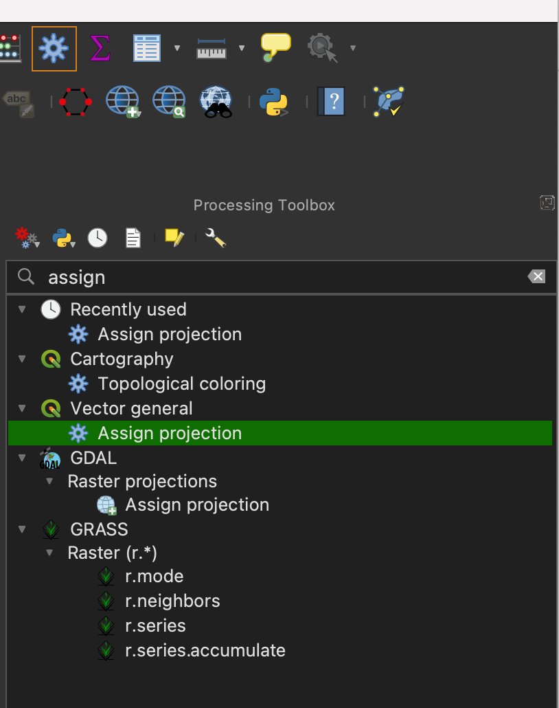

## Video Tutorial



## In this tutorial

Understand the basics of Coordinate Reference Systems (CRSs) and map projections. See how they function based on the layers you add and learn to adjust your project CRS.

Learn more about troubleshooting CRS issues: [I Hate Coordinate Systems!](https://ihatecoordinatesystems.com/){target="_blank"}

**Timestamps (Click a link to start that segment in a new window)**

[0:00 - 5:25](https://youtu.be/3N3MjZQbCaw?si=kA8Pfp4KwkXNTgfc): Define a project CRS by first loading the [borough boundaries](https://data.cityofnewyork.us/City-Government/Borough-Boundaries/gthc-hcne) shapefile, which is defined in the NYC-appropriate CRS 2263.

[5:22 - 8:34](https://youtu.be/3N3MjZQbCaw?si=QT8DQ_7eMdZtEyD_&t=322): Load a shapefile first containing stormwater outflow features across all of NYS in with a CRS of 4326, which looks distorted for NYC. Change the whole project CRS to 2263 to get NYC back to a familiar shape.

## Troubleshooting

One of the *most* common issues that arises with CRSs is that your data is not showing up in the location it should be. This is likely because a dataset is [defined in the wrong CRS](https://ihatecoordinatesystems.com/#wrong-crs). Here's one [solution](https://ihatecoordinatesystems.com/#redefine).

-   First, right click your layer the layer that's not displaying where you expect it and select "Zoom to layer(s)" to locate it. It will appear that one of your datasets is 'far away' from the other. If you don't see anything at all, there's a different issue with your data displaying.

-   To change this layer's CRS, click the icon that looks like a gear in your toolbar to open the Processing Toolbox (or find it by typing it in the search bar). Type "Assign projection" and click the tool that has the same icon, rather than one that looks like a globe (this is the tool for vector data, versus raster data).

    {width="277"}

-   Select the input layer of the dataset with the projection you want to change and the CRS you want to change it to.

-   The output will be a temporary later; right click it and select Export \> Save Features As... to save it to your project folder (make sure to click the three dots to the right of 'Browse' to locate the right location on your computer).

-   For additional CRS problems, see [I Hate Coordinate Systems!](https://ihatecoordinatesystems.com/){target="_blank"}. You can also try Googling the problem, asking us on Slack, or asking AI.

## Data downloads

[Borough boundaries](https://data.cityofnewyork.us/City-Government/Borough-Boundaries/gthc-hcne)

[NYC subway stations](https://data.ny.gov/Transportation/MTA-Subway-Stations/39hk-dx4f/about_data)

Stormwater outfalls:

-   via [NYS GIS Clearinghouse](https://data.gis.ny.gov/datasets/94a7b7a3c5cc4f409622523b04ee06bf_0/explore?location=42.242572%2C-75.466961%2C7.24) - download GeoJSON format for clearest difference in CRS

-   [Saved copy](https://drive.google.com/open?id=10z5v3ZQ2LrKg363FYahnwTfxUBZzOXZ1&usp=drive_fs)
